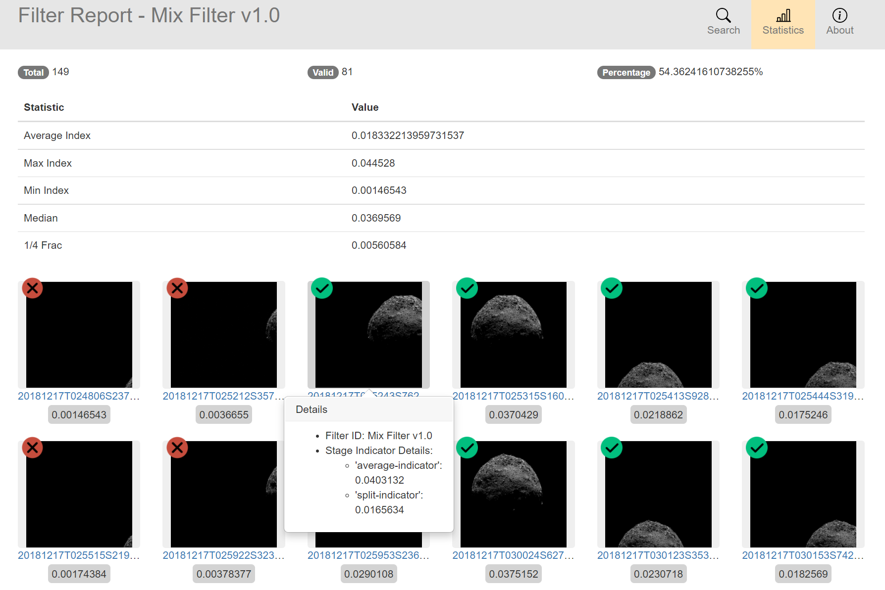

# image-filter
Dedicated to picking out best images for asteroid reconstruction

## Workflow
A general image filter is provided to be flexible enough for filtering.
You may write your own image quality indicators, add them to the filter, impose a calculation method and invoke ```ImageFilter::filter``` function
to pick out appropriate images for reconstruction.

## Visualization
HTML-based visualization tool is available to visualize the filtering result. Indicator scores of every stage can be found on the **automatically** generated local web page. Also, a form of incomplete statistics concerning the result is shown on top of the page.


## Customize Quality Indicator
* Subclass any Indicator class to extend the quality assessment algorithm. There exists an abstract class ```ar::Indicator``` which has a pure virtual function ```Indicator::calc()``` that needs to be implemented.
* Add indicators to the filter by calling ```ar::ImageFilter::addIndicator()``` which takes ```std::vector< std::shared_ptr<Indicator> >``` object as the argument.
* Define a function to apply filtering condition for the filter, and call ```ar::ImageFilter::setFilterCondition()```.